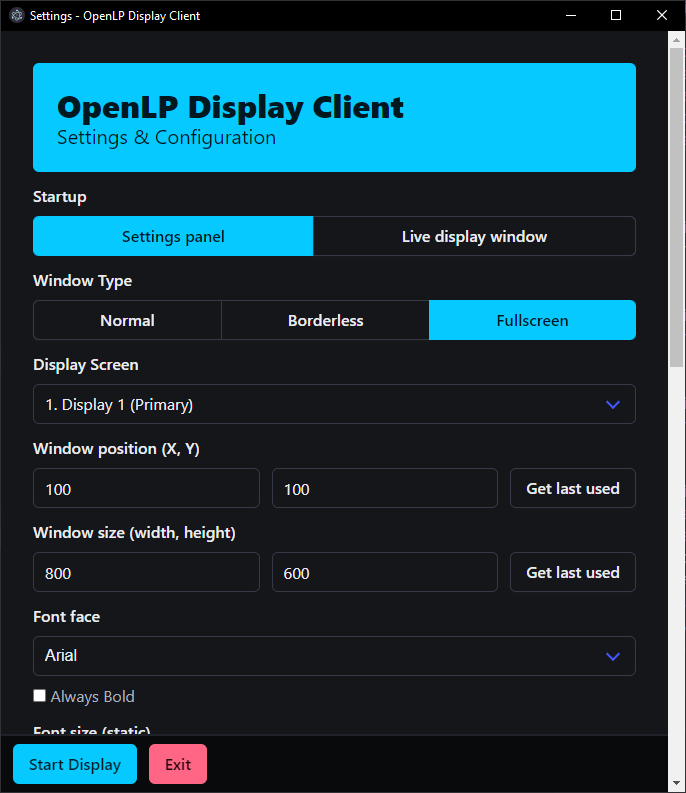
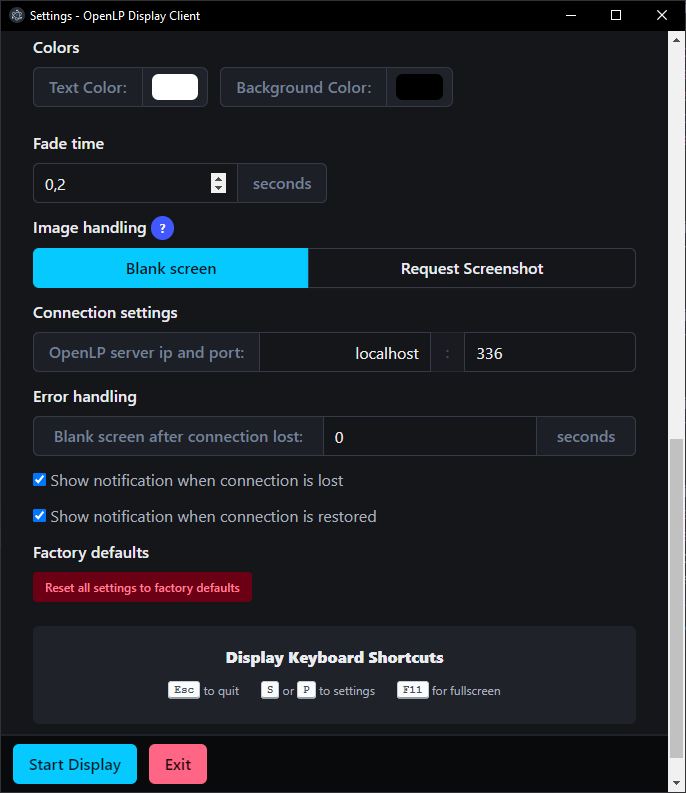

# 🎥 OpenLP Display Client

A modern, flexible Electron-based display application for OpenLP that brings your presentations to life with seamless multi-display support and real-time updates.

---

## ✨ Features

🖥️ **Multi-Display Support** • 🪟 **Flexible Window Modes** • 📐 **Smart Text Sizing** • ⚡ **Real-Time Updates**

- **Advanced Display Management**

  - Multi-display support with configurable screen selection
  - Choose between Normal and Fullscreen window modes
  - Intelligent window position and size memory

- **Smart Content Handling**

  - Automatic text sizing and formatting
  - Real-time updates via WebSocket connection
  - Instant response to OpenLP's display controls

- **User-Friendly Interface**
  - Intuitive settings configuration
  - Quick keyboard shortcuts
  - Automatic reconnection handling

---

## 📸 Screenshots

  
  

---

## Usage

### Launch Modes

- **Settings Mode** (Default)
  - Opens the configuration window
  - Customize all display preferences
- **Display Mode**
  - Launches directly to presentation display
  - Uses saved configuration settings

### 🎮 Keyboard Controls

| Key        | Action               |
| ---------- | -------------------- |
| `ESC`      | Close display window |
| `S` or `P` | Switch to settings   |

---

## ⚙️ Configuration

The settings interface provides complete control over:

- 🎯 Target display selection
- 🪟 Window mode (Normal/Fullscreen)
- 📐 Window position and dimensions
- 🚀 Launch behavior preferences
- 🔌 Connection settings

---

## 📋 Requirements

- OpenLP with Web Remote functionality enabled
- Active network connection between OpenLP and display client

---

## 👨‍💻 Author

Created with ❤️ by LostViking09

